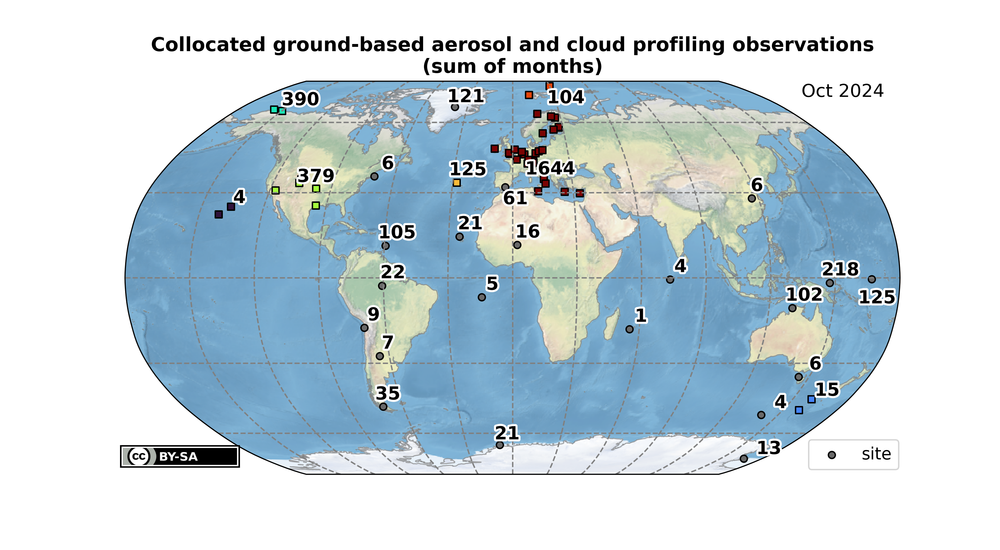
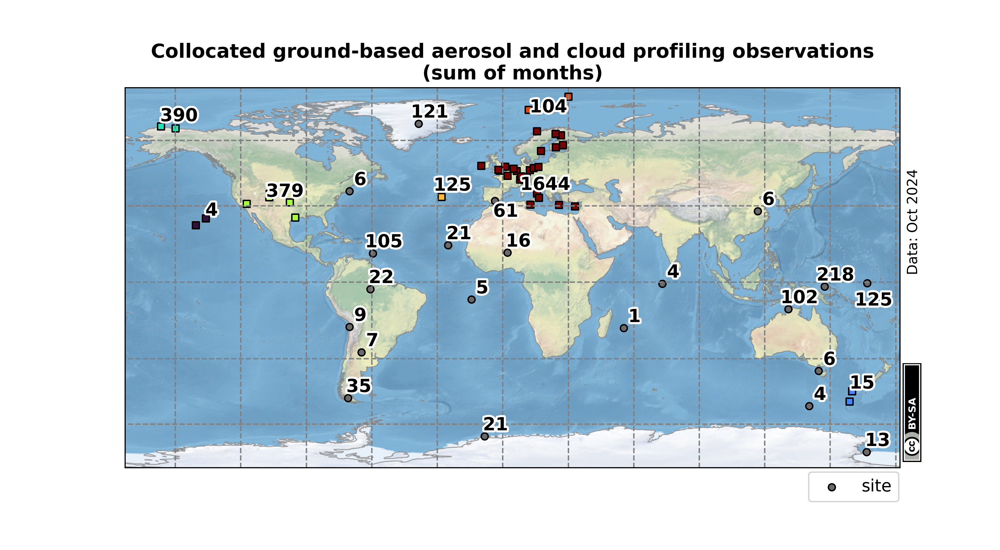
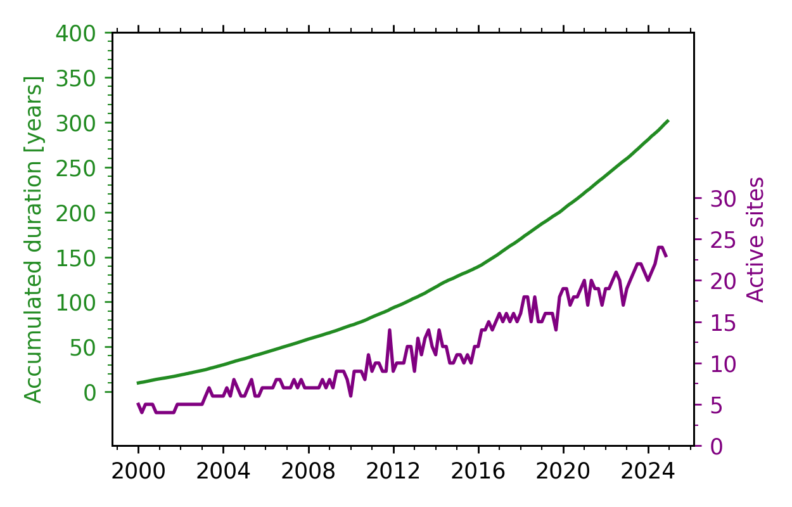
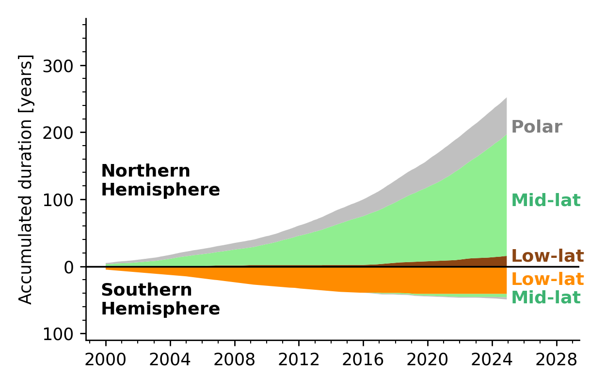
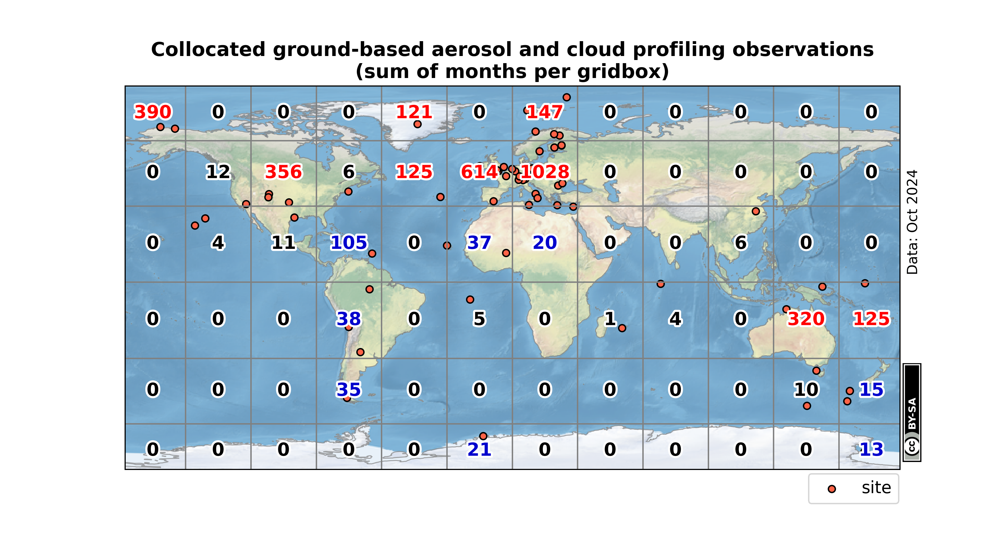
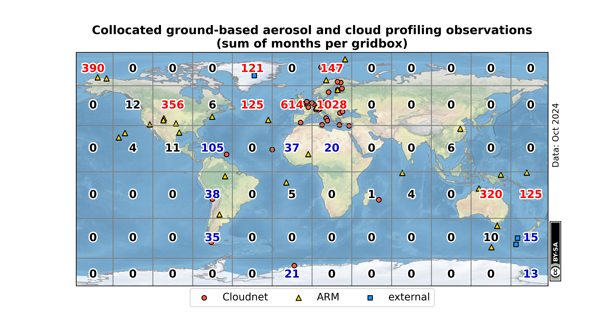
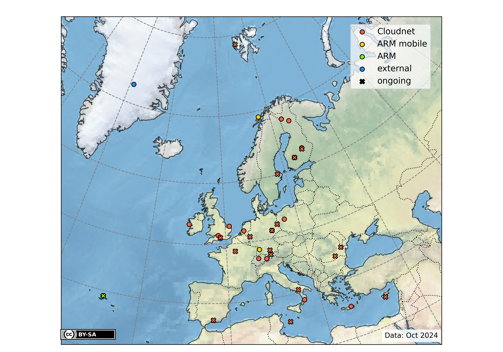

# Global stations with ground-based cloud and aerosol profiling

Overview of stations where ground-based profiling of clouds and aerosols with at least a cloud radar (Ka or W Band) and a collocated lidar is performed.
A similar overview was for example given by Bühl [2017]. In this version a plot with the months of observations summed over a gridbox is provided.
The numbers are colored blue for more than 12 months and red for more than 120 months of observations per gridbox.
The underlying data is mostly from the [cloudnet](http://cloudnet.fmi.fi/) and [ARM](https://www.arm.gov/) websites. Hence, the statistics only consideres openly accessible datasets.
**Update**: Scraping of the new cloudnet database api is done by [extract_cloudnet_metadata.ipynb](extract_cloudnet_metadata.ipynb).

In case of any additions, errors or comments your feedback is appreciated.

## Clustering
For now, the clustering is done with `sklearn.cluster.DBSCAN` with the great circle distance as a metric.
The threshold (keyword `eps`) is set to 1000 km. 
(Old versions just used the difference in degrees).

## References
 Bühl, J., S. Alexander, S. Crewell, A. Heymsfield, H. Kalesse, A. Khain, M. Maahn, K. Van Tricht, and M. Wendisch, 2017: Remote Sensing. Meteorological Monographs, 58, 10.110.21, https://doi.org/10.1175/AMSMONOGRAPHS-D-16-0015.1

## Plots

### Clustered sum of observations

### Timeseries

### Gridded sum of observations

### Locations per network

